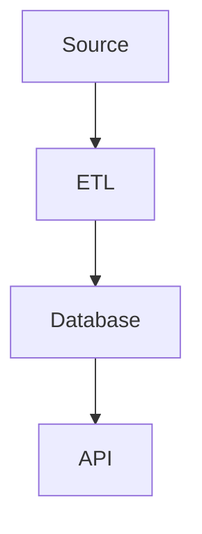

# Architecture

## Overview
High-level architecture of the system.

## Components
- Component A
- Component B

## Diagram

```mermaid
graph TD
    Source --> ETL
    ETL --> Database
    Database --> API
```

## Notes
- Key design decisions
- Constraints