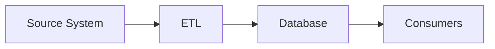

# Data Flow

## Overview
Description of how data moves through the system.

## Flow

```mermaid
flowchart LR
    A[Source System] --> B[ETL]
    B --> C[Database]
    C --> D[Consumers]
```

## Transformations
- Mapping rules
- Validation logic